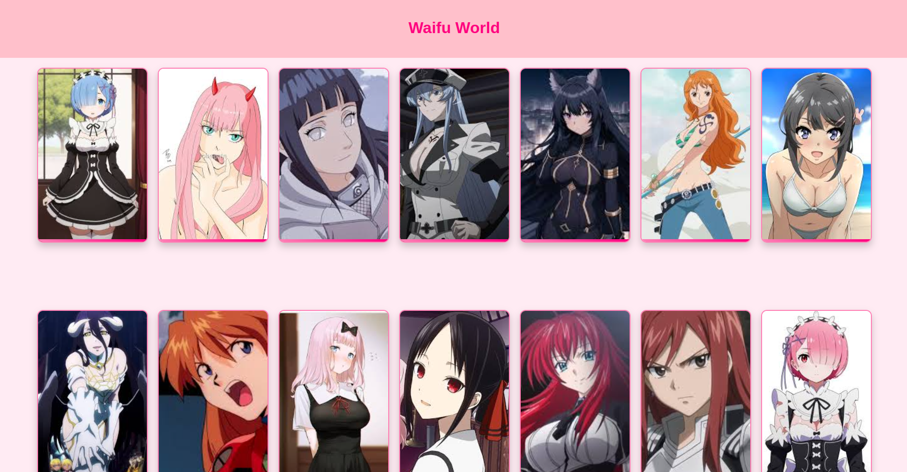

# **WAIFU WORLD**

Bienvenue dans **Waifu World**, une application React où vous pouvez découvrir et admirer vos waifus préférées d'animés ! Cette galerie interactive permet de parcourir une collection de waifus, chacun accompagné de son image, de son anime d'origine et de sa note.

---

## **Table des matières**

1. [Prérequis](#prérequis)
2. [Installation](#installation)
3. [Structure du projet](#structure-du-projet)
4. [Technologies utilisées](#technologies-utilisées)
5. [Fonctionnalités](#fonctionnalités)
6. [Captures d'écran](#captures-décran)
7. [Contribuer](#contribuer)
8. [Notes supplémentaires](#notes-supplémentaires)
9. [Licence](#licence)

---

## **Prérequis**

Avant de commencer, assurez-vous d'avoir installé les éléments suivants sur votre machine :

- **Node.js** (version 14 ou supérieure) - [Téléchargez-le ici](https://nodejs.org/).
- **npm** (le gestionnaire de paquets de Node.js) - npm est généralement installé automatiquement avec Node.js.

---

## **Installation**

### 1. **Clonez le projet**  
Commencez par cloner ce dépôt sur votre machine locale :

```bash
git clone https://github.com/le-pseudo/waifu-world.git
```

## Structure Du Projet

waifu-world/
├── public/
│   ├── index.html             
│   ├── assets/
│   │   └── waifus/              
├── src/
│   ├── components/
│   │   ├── WaifuCard.jsx        
│   │   ├── WaifuList.jsx        
│   ├── App.jsx                  
│   ├── index.js                 
│   ├── App.css                  
├── package.json                 
├── README.md                    

## **Technologies utilisées**

Ce projet utilise les technologies suivantes :

- **React** : Bibliothèque JavaScript pour construire des interfaces utilisateur interactives.
- **CSS** : Pour la mise en forme et le design des composants.
- **npm** : Gestionnaire de dépendances.
- **React Router** (si vous ajoutez des pages supplémentaires à l'avenir).


## **Fonctionnalités**

- **Affichage de waifus** : Chaque waifu est affichée sous forme de carte, avec son image, son nom, son anime d'origine et une note sur 10.
- **Design interactif** : Les cartes des waifus réagissent au survol (agrandissement et effets visuels) pour une meilleure expérience utilisateur.
- **Images dynamiques** : Les images des waifus sont chargées dynamiquement depuis le dossier `public/assets/waifus`.
- **Responsive** : Le design est adapté pour tous types de dispositifs, que ce soit desktop, tablette ou mobile.

## **Captures d'écran**

Voici à quoi ressemble l'application :



